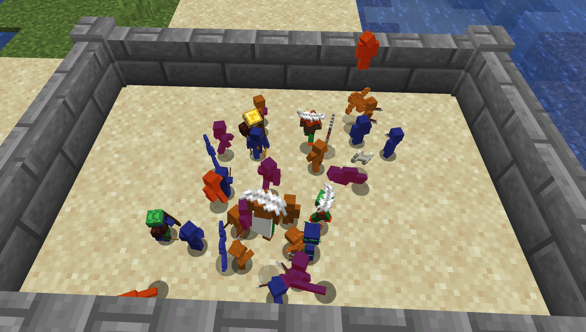
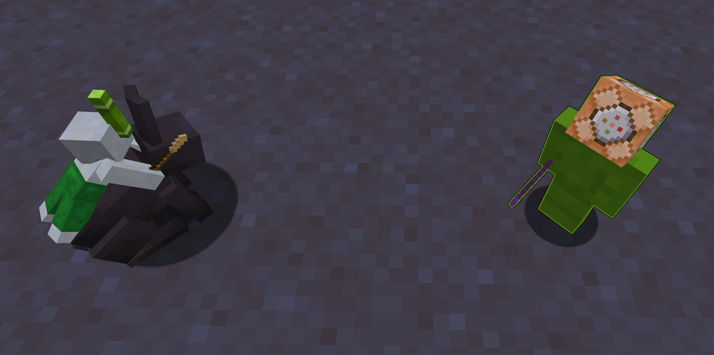

# Clay Soldier Remake  

Clay Soldiers Remake is a data driven remake of the classic Clay Soldiers mod,
bringing the miniature army-building experience to newer Minecraft versions.
Just like the original, you can create tiny, customizable clay warriors
and watch them battle in epic skirmishes.

CSR has compatibility with datapacks,
allowing you to easily add new or modify existing items and gear, that Clay Soldiers can wear.
[_(Learn More)_](https://bumble-b33.github.io/csr-wiki-v2/)

---

